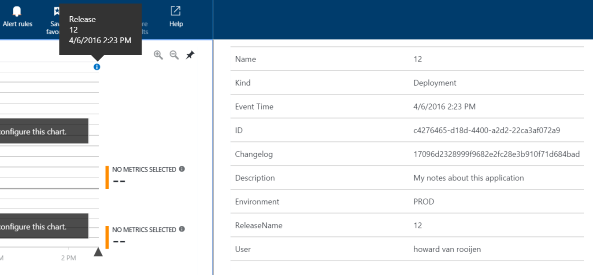
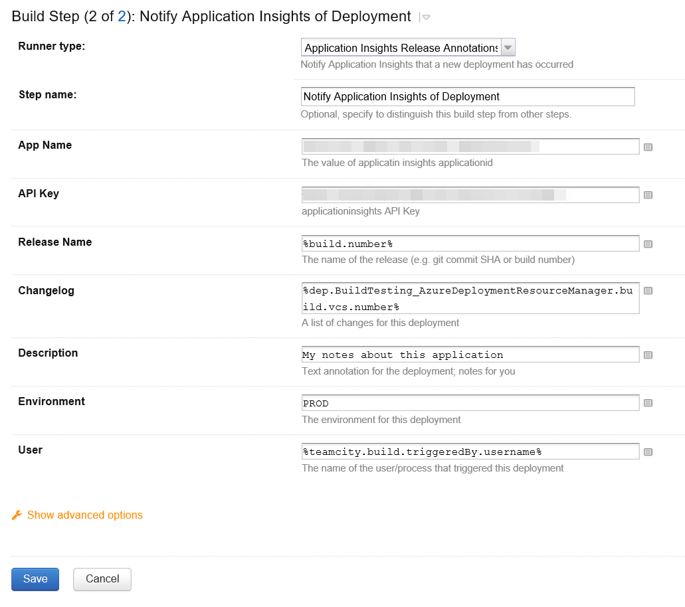

Application Insights Release Annotations MetaRunner
===================================================

A TeamCity MetaRunner to notify Application Insights that a new deployment has occurred.

You can configure the values that are passed to Application Insights via the TeamCity MetaRunner build step:

More details about this MetaRunner are in the following blog post:

To build the MetaRunner - use Build\build-powershellrunner.cmd to package up the MetaRunner - the zip file is available in the Drops folder.

See the following blog posts for more information about Application Insights:

- [Application Insights announces availability of Release Annotations](https://azure.microsoft.com/en-gb/blog/application-insights-announces-availability-of-release-annotations/)
- [Application Insights: Powershell script available for creating Release Annotations](https://azure.microsoft.com/en-gb/blog/application-insights-powershell-script-available-for-creating-release-annotations/)
- [Annotations detail blade now available in Application Insights](https://azure.microsoft.com/en-gb/blog/annotations-detail-blade-now-available-in-application-insights/)

[@HowardvRooijen](http://twitter.com/howardvrooijen) | [@endjin](http://twitter.com/endjin)
